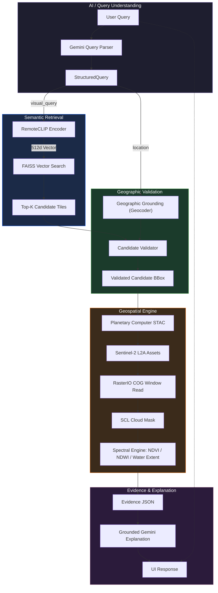
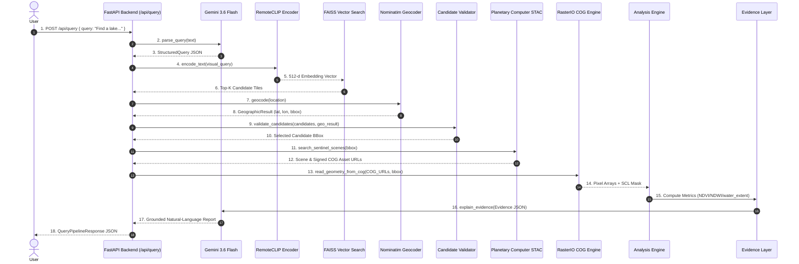

# GeoQueryAI
### Find. Measure. Explain.

[](https://www.python.org/)
[](https://fastapi.tiangolo.com/)
[](https://deepmind.google/technologies/gemini/)
[](https://github.com/nachet-gate/RemoteCLIP)
[](https://github.com/facebookresearch/faiss)
[](https://planetarycomputer.microsoft.com/)
[](https://rasterio.readthedocs.io/)

Ask an Earth-observation question in natural language. GeoQueryAI discovers relevant satellite imagery, validates the spatial candidate, performs quantitative geospatial analysis, and explains the computed evidence.

> **AI interprets the question. Geospatial computation produces the evidence.**

> **The LLM does not measure the Earth. It explains measurements computed by the geospatial pipeline.**

---

## 1. Problem

Extracting quantitative insights from satellite imagery requires non-expert users to navigate technical complexity across separate tools:

```
Coordinates / Parameters ──► Manual STAC Search ──► Scene Selection ──► Raster Processing ──► Spectral Analysis ──► Interpretation
```

Users typically require specialized knowledge of:
1. Satellite constellations and dataset collections (`sentinel-2-l2a`).
2. Geographic coordinates and spatial bounding boxes.
3. STAC catalog search APIs and cloud-cover filtering.
4. Satellite scene selection and asset URL signing.
5. Multi-gigabyte raster image downloads and window cropping.
6. Band math transformation scripts to compute spectral indices.

A general-purpose LLM can describe environmental concepts, but it does not inherently have access to the specific satellite pixels required to compute a measurement for a user-defined area.

---

## 2. Solution

GeoQueryAI connects natural-language intent to a reproducible Earth-observation computation pipeline:

```
Natural Language Query
  ↓
Gemini Query Parser (Schema Enforcement)
  ↓
RemoteCLIP + FAISS (Semantic Candidate Retrieval)
  ↓
Candidate Validation (Geographic Grounding & Spatial Filter)
  ↓
Planetary Computer STAC (Sentinel-2 L2A Retrieval)
  ↓
RasterIO COG Window Read (HTTP Range Requests)
  ↓
SCL Cloud Masking (Scene Classification Layer Filter)
  ↓
Spectral Engine (NDVI / NDWI / Water Extent)
  ↓
Evidence JSON (Verifiable Payload)
  ↓
Grounded Gemini Explanation (Report Generation)
```

---

## 3. How It Works

GeoQueryAI structures every user query through six functional phases:

$$\text{ASK} \longrightarrow \text{UNDERSTAND} \longrightarrow \text{FIND} \longrightarrow \text{VALIDATE} \longrightarrow \text{MEASURE} \longrightarrow \text{EXPLAIN}$$

- **ASK:** User enters a natural-language question (e.g., *"Find a lake around Bengaluru and calculate its water extent."*).
- **UNDERSTAND:** Gemini parses natural language into a structured Pydantic `StructuredQuery` schema (`visual_query`, `location`, `analysis`, `start_date`, `end_date`).
- **FIND:** RemoteCLIP encodes the visual query into a 512-dimensional vector; FAISS retrieves Top-K candidate satellite tiles from precomputed vector index embeddings.
- **VALIDATE:** Geographic grounding converts the location place name into spatial boundaries via OpenStreetMap Nominatim and verifies that candidate tile bounding boxes intersect the requested region.
- **MEASURE:** The geospatial engine queries Planetary Computer STAC for Sentinel-2 L2A scenes, executes HTTP range-request windowed COG reads, applies Scene Classification Layer (SCL) cloud masking, and computes physical metrics (NDVI, NDWI, water extent).
- **EXPLAIN:** Gemini receives an Evidence JSON payload and synthesizes a natural-language report grounded strictly in the computed physical metrics.

---

## 4. Architecture Diagram



---

## 5. System Sequence Diagram



---

## 6. Technical Differentiation

> **"GeoQueryAI connects natural-language intent to a reproducible Earth-observation computation pipeline."**

GeoQueryAI's contribution is an integrated natural-language-to-measurement workflow that connects semantic EO discovery with reproducible geospatial computation. It does not replace professional GIS software or human spatial experts, but rather automates the initial search, spatial validation, cloud masking, and metric computation steps.

| Layer | Traditional EO Workflow | GeoQueryAI |
| :--- | :--- | :--- |
| **Query Input** | Coordinates / technical parameters | Natural-language question |
| **Discovery** | Manual catalog search | RemoteCLIP + FAISS semantic retrieval |
| **Candidate Selection** | Manual user selection | Retrieval + spatial validation |
| **Data Access** | Manual scene selection / download | STAC-driven windowed COG HTTP range reads |
| **Processing** | Manual GIS desktop / custom scripts | Automated raster pipeline & SCL cloud masking |
| **Measurement** | User manually computes spectral indices | Deterministic spectral metrics (NDVI/NDWI) |
| **Interpretation** | Manual visual interpretation | Evidence-grounded explanation |

---

## 7. AI & Semantic Retrieval Pipeline

### 1. Gemini Query Parser
Converts natural language into a strict Pydantic `StructuredQuery` schema:
- `visual_query`: Visual concept description for RemoteCLIP image matching.
- `location`: Free-text place name string (context only).
- `analysis`: Target spectral calculation (`discovery`, `ndvi`, `ndwi`, `water_extent`, `change`, `water_extent_change`).
- `start_date` / `end_date`: Optional temporal bounds.

> **Coordinates generated by the LLM are never used as the trusted analysis AOI.**  
> Bounding box coordinates come exclusively from candidate tile spatial validation.

### 2. RemoteCLIP Vision-Language Encoder
- **Architecture:** RemoteCLIP (`ViT-B-32`), fine-tuned specifically on remote-sensing vision-language datasets.
- **Embedding:** Maps text queries into a 512-dimensional normalized vector space matching remote-sensing visual features.

### 3. FAISS Vector Store
- **Index:** `IndexFlatIP` storing precomputed 512-d embeddings for satellite tile imagery.
- **Search:** Inner-product cosine similarity retrieval returning Top-K candidate tiles.

> **Semantic similarity produces candidate imagery, not geographic ground truth.**

### 4. Geographic Candidate Validation
> **Top-1 similarity is not blindly treated as the final location.**

1. Geocodes `location` text via Nominatim to centroid `(lat, lon)` and bounding box.
2. Checks whether candidate tile `bbox` contains or intersects the geocoded location.
3. Selects the highest-ranked candidate that satisfies spatial containment constraints.

### 5. Architectural Distinction: RemoteCLIP vs. STAC
A central technical design of GeoQueryAI is that **RemoteCLIP does not "know" the same image as STAC**. RemoteCLIP and STAC serve complementary functions:

- **RemoteCLIP answers:** *Which indexed imagery looks semantically relevant to the user's visual query?*
- **STAC answers:** *Which authoritative satellite scene covers the validated geographic area for the requested dates?*
- **Raster Computation answers:** *What can actually be measured from those pixels?*

The user intent flows through RemoteCLIP for candidate discovery, spatial validation determines whether candidate bounding boxes belong to the requested location, the validated bounding box acts as the geographic bridge, and STAC independently fetches authoritative Sentinel-2 L2A imagery for pixel-level analysis.

---

## 8. Geospatial Engine

### STAC & Cloud-Optimized GeoTIFF (COG)
- **STAC Catalog:** Microsoft Planetary Computer (`sentinel-2-l2a` collection).
- **Windowed Read:** Reads only the target bounding box window via HTTP range requests using `rasterio.windows.from_bounds`, bypassing full scene downloads.

### SCL Cloud & Shadow Masking
Sentinel-2 Scene Classification Layer (SCL) filters invalid pixels before metric computation:
- Filtered Classes: `0` (No data), `1` (Defective), `3` (Cloud shadow), `8` (Cloud medium prob), `9` (Cloud high prob), `10` (Cirrus), `11` (Snow/Ice).

### Implemented Spectral Workflows
- **NDVI (Normalized Difference Vegetation Index):**
  $$\text{NDVI} = \frac{\text{B08 (NIR)} - \text{B04 (Red)}}{\text{B08 (NIR)} + \text{B04 (Red)}}$$
- **NDWI (Normalized Difference Water Index):**
  $$\text{NDWI} = \frac{\text{B03 (Green)} - \text{B08 (NIR)}}{\text{B03 (Green)} + \text{B08 (NIR)}}$$
- **Water Extent Calculation:**
  $$\text{Water Mask} = (\text{NDWI} > 0.0) \land \text{Valid SCL}$$
  $$\text{Water Area (km}^2\text{)} = \text{Water Pixel Count} \times \left(\frac{10}{1000}\right)^2$$

*Supported single-date analyses include `discovery`, `ndvi`, `ndwi`, and `water_extent`. Temporal change analysis (`change`, `water_extent_change`) is an extension point / ongoing work.*

---

## 9. Evidence-Grounded Explanation

The geospatial pipeline constructs an Evidence JSON payload containing verified metrics:

```json
{
  "location": "Bengaluru",
  "bbox": [77.588237, 12.971785, 77.597542, 12.98091],
  "scene_id": "S2C_MSIL2A_20251208T051221_R019_T43PGQ_20251208T081319",
  "acquisition_date": "2025-12-08T05:12:21.025000+00:00",
  "analysis": "water_extent",
  "computed_values": {
    "water_pixels": 42,
    "total_pixels": 10204,
    "water_fraction": 0.0041,
    "water_area_km2": 0.0042
  },
  "source": "Sentinel-2 L2A via Planetary Computer STAC"
}
```

Gemini receives computed evidence and is instructed to explain only the supplied values and avoid unsupported claims.

---

## 10. Scientific Safety Note

> **Semantic retrieval identifies candidate imagery; it is not ground truth. Spatial validation and deterministic geospatial computation provide the basis for downstream measurements.**

> **NDWI-derived water extent is a threshold-based analytical estimate ($\text{NDWI} > 0.0$) and should not be interpreted as a complete measure of water quality, turbidity, or ecosystem health.**

---

## 11. Verified End-to-End Example

### User Query:
> *"Find a lake around Bengaluru and calculate its water extent."*

### Measured Pipeline Result:
```json
{
  "query_id": "fae079f6-a3de-4a8f-b5e2-0a62ac2980f2",
  "query": "Find a lake around Bengaluru and calculate its water extent.",
  "structured_query": {
    "visual_query": "lake or water body",
    "location": "Bengaluru",
    "analysis": "water_extent",
    "start_date": null,
    "end_date": null
  },
  "geographic_result": {
    "name": "Bengaluru",
    "latitude": 12.9767936,
    "longitude": 77.590082,
    "bbox": [77.4598797, 12.8334905, 77.7840639, 13.1426196],
    "display_name": "Bengaluru, Bangalore North, Bengaluru Urban, Karnataka, India",
    "grounded": true
  },
  "candidates": [
    { "tile_id": "ulsoor_001", "score": 0.2511 },
    { "tile_id": "urban_002", "score": 0.2336 }
  ],
  "selected_candidate": {
    "tile_id": "veg_cubbon_park",
    "bbox": [77.588237, 12.971785, 77.597542, 12.98091]
  },
  "validation_status": "passed",
  "analysis_result": {
    "analysis": "water_extent",
    "scene": {
      "scene_id": "S2C_MSIL2A_20251208T051221_R019_T43PGQ_20251208T081319",
      "datetime": "2025-12-08T05:12:21.025000+00:00",
      "cloud_cover": 0.000057,
      "valid_pixel_fraction": 1.0
    },
    "metrics": {
      "water_pixels": 42,
      "total_pixels": 10204,
      "water_fraction": 0.0041,
      "water_area_km2": 0.0042
    },
    "status": "ok"
  },
  "explanation": "Based on Sentinel-2 L2A imagery acquired on December 8, 2025, a water extent analysis was conducted for a 0.9998 km² area of interest in Bengaluru. Using a Normalized Difference Water Index (NDWI) threshold of 0.0, the analysis identified 42 water pixels out of 10,204 valid pixels. This corresponds to a total surface water area of 0.0042 km², representing a water fraction of approximately 0.41% (0.0041) of the analyzed area."
}
```

---

## 12. Technology Stack

| Layer | Technology | Purpose |
| :--- | :--- | :--- |
| **AI / LLM** | Gemini 3.6 Flash | Natural-language query parsing & evidence explanation |
| **Vision-Language** | RemoteCLIP (`ViT-B-32`) | Domain-specific remote sensing text/image embeddings |
| **Vector Search** | FAISS (`IndexFlatIP`) | Inner-product vector similarity search over tile embeddings |
| **Geocoding** | Nominatim / OpenStreetMap | Location place name resolution to spatial coordinates |
| **STAC Catalog** | Microsoft Planetary Computer | Sentinel-2 L2A STAC metadata search & signed SAS URLs |
| **Satellite Data** | Sentinel-2 L2A | 10m multi-spectral surface reflectance satellite imagery |
| **Raster Engine** | RasterIO / PySTAC / Shapely | Windowed COG HTTP range reads & SCL cloud masking |
| **Spectral Analysis** | NumPy | In-memory array math for NDVI, NDWI, and water extent |
| **Backend API** | FastAPI / Uvicorn | Asynchronous REST API server |
| **Validation** | Pydantic V2 | Strict type enforcement and contract validation |

---

## 13. API Endpoints

- **`POST /api/query`**: Main natural-language pipeline endpoint (Gemini parsing $\rightarrow$ RemoteCLIP + FAISS $\rightarrow$ spatial validation $\rightarrow$ STAC/COG analysis $\rightarrow$ Gemini explanation).
- **`POST /api/search`**: Isolated semantic retrieval endpoint (RemoteCLIP + FAISS top-K candidate search).
- **`POST /api/analyze`**: Isolated geospatial raster analysis endpoint for a known bounding box (`[min_lon, min_lat, max_lon, max_lat]`).
- **`POST /api/maps/ndvi`**: Point-based NDVI analysis rendering static PNG map overlays.
- **`POST /api/maps/ndwi`**: Point-based NDWI analysis rendering static PNG map overlays.
- **`POST /api/maps/change-detection`**: Point-based two-period NDVI change analysis.
- **`GET /health`**: Health probe endpoint.

---

## 14. Repository Structure

```text
GeoQuery/
├── backend/
│   ├── app/
│   │   ├── api/
│   │   │   └── routes/
│   │   │       ├── analysis.py       # POST /api/analyze (standalone raster analysis)
│   │   │       ├── maps.py           # POST /api/maps/* (rendered PNG map overlays)
│   │   │       ├── query.py          # POST /api/query (end-to-end NL pipeline)
│   │   │       └── search.py         # POST /api/search (standalone retrieval)
│   │   ├── core/
│   │   │   ├── config.py             # Application settings & environment loader
│   │   │   └── errors.py             # Custom exceptions & HTTP status mapping
│   │   ├── schemas/                  # Pydantic models (query, analysis, search)
│   │   ├── services/
│   │   │   ├── ai/                   # Gemini parser & evidence explainer
│   │   │   ├── geo/                  # Geocoder, STAC client, COG raster service
│   │   │   └── search/               # RemoteCLIP encoder, FAISS store & validator
│   │   └── main.py                   # FastAPI application entry point
│   ├── tests/                        # 53 passing automated software tests
│   └── requirements.txt              # Backend python dependencies
├── data/
│   └── satellite_tiles/              # Satellite tile dataset & metadata
├── indexes/                          # FAISS vector index & metadata mapping
├── models/                           # RemoteCLIP model checkpoint (.pt)
├── scripts/                          # FAISS index builder & tile generation scripts
├── pytest.ini                        # Pytest configuration
├── README.md                         # Project documentation
└── .gitignore                        # Git ignore file (excludes .env and secret files)
```

---

## 15. Setup & Installation

### 1. Clone & Setup Environment
```bash
git clone https://github.com/Bhagyajyothi-sk/GeoQuery.git
cd GeoQuery

python -m venv .venv

# On Windows PowerShell:
.venv\Scripts\activate
# On Linux/macOS:
source .venv/bin/activate

pip install -r backend/requirements.txt
```

### 2. Environment Configuration
Create a `.env` file locally in the project root:

```env
# Local Environment Configuration (.env is ignored by Git)
MOCK_AI=false
MOCK_SEARCH=false
MOCK_GEO=false

# Gemini API Key
GEMINI_API_KEY=your_key_here

# RemoteCLIP & FAISS Paths
REMOTECLIP_MODEL_PATH=models/RemoteCLIP-ViT-B-32.pt
FAISS_INDEX_PATH=indexes/satellite.index
TILE_METADATA_PATH=indexes/tile_metadata.json
```

*Note: Keep `.env` local and never commit API keys to version control.*

### 3. Run Backend Server
```bash
uvicorn backend.app.main:app --reload --host 0.0.0.0 --port 8000
```
Access interactive OpenAPI docs at `http://localhost:8000/docs`.

---

## 16. Mock Mode vs. Real Mode

> **GeoQueryAI can run its complete software pipeline in deterministic mock mode without API keys, RemoteCLIP weights, or network access.**

- **MOCK MODE (`MOCK_AI=true`, `MOCK_SEARCH=true`, `MOCK_GEO=true`):** Used for fast, offline software development and automated API contract testing.
- **REAL MODE (`MOCK_AI=false`, `MOCK_SEARCH=false`, `MOCK_GEO=false`):** Connects live Gemini 3.6 Flash, RemoteCLIP PyTorch model, FAISS index, Nominatim geocoding, and Planetary Computer STAC COG reads.

*Mock metrics are synthetic and must not be interpreted as satellite measurements.*

---

## 17. Automated Testing & Software Validation

The software test suite includes **53 passing tests** validating schemas, pipeline contracts, RemoteCLIP/FAISS integration, spatial validation, API routes, and error handling:

```bash
d:\GeoQuery\.venv\Scripts\python.exe -m pytest
```
```text
======================= 53 passed, 1 warning in 14.62s ========================
```

- **Pipeline Tests (`test_pipeline.py`)**: 34 / 34 PASSED
- **RemoteCLIP / FAISS Tests (`test_remoteclip.py`)**: 19 / 19 PASSED

*These software integration tests validate component execution, contract schemas, and error handling; formal quantitative retrieval benchmarks represent future work.*

---

## 18. Current Engineering Limitations

- **Indexed Tile Scope:** RemoteCLIP semantic search operates over precomputed tile index embeddings. Queries outside the index rely on candidate spatial validation to reject out-of-scope tiles gracefully.
- **Semantic Retrieval:** Semantic similarity identifies candidate imagery; it is not geographic ground truth.
- **Spatial Validation:** Spatial containment validation is required to prevent visual top-1 false positives.
- **Analytical Heuristics:** Water extent estimation uses threshold-based NDWI ($\text{NDWI} > 0.0$) with SCL cloud screening.
- **Formal Benchmarking:** Formal Recall@K / MRR retrieval benchmarks are not yet implemented.
- **Temporal Change Analysis:** Multi-date temporal change analysis remains future work / extension point.
- **External Dependencies:** Real mode requires network connections to Planetary Computer STAC and OpenStreetMap Nominatim.

---

## 19. Future Work

- [ ] **Scaled Tile Index:** Expand FAISS index coverage to large regional satellite tile archives.
- [ ] **Retrieval Benchmarking:** Implement Recall@1 / Recall@5 / MRR retrieval benchmarks on standardized remote sensing datasets.
- [ ] **Reranking:** Improve candidate reranking combining visual similarity and spatial resolution metrics.
- [ ] **Temporal Change Analysis:** Implement dual-date baseline/target scene differencing.
- [ ] **SAR Fallback:** Integrate Sentinel-1 Synthetic Aperture Radar (SAR) for cloud-penetrating water mapping.
- [ ] **Adaptive Thresholding:** Add Otsu thresholding for variable water quality.
- [ ] **Scalable Indexing:** Production-scale caching and vector search indexing.

---

## 20. Contributors

- **Bhagyajyothi Koutagi** ([@Bhagyajyothi-sk](https://github.com/Bhagyajyothi-sk))
- **N S Shamika** ([@nsshmaika](https://github.com/nsshmaika))
- **Mizba Khanum** ([@M-zz-k](https://github.com/M-zz-k))
